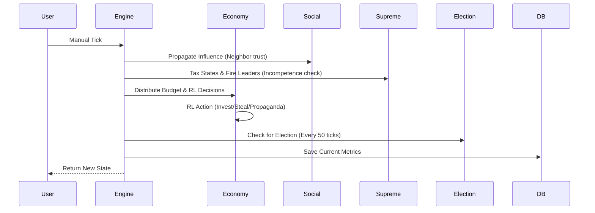

# Architecture & Design

This document outlines the technical architecture and data flow of the Sworm System.

## System Architecture

```mermaid
graph TD
    subgraph Frontend (React + PixiJS)
        UI[App.tsx]
        Map[NationMap.tsx]
        Dash[SimulationDashboard.tsx]
        Chart[HistoryCharts.tsx]
    end

    subgraph Backend (FastAPI)
        Engine[SimulationEngine]
        RL[QLearningAgent]
        Economy[EconomyService]
        Social[InfluenceService]
        Supreme[SupremeLeaderService]
        Election[ElectionService]
    end

    subgraph Persistence
        DB[(SQLite / sworm_history.db)]
    end

    UI -->|API Calls| Engine
    Engine --> Economy
    Engine --> Social
    Engine --> Supreme
    Engine --> Election
    Economy --> RL
    Engine -->|Persist Metrics| DB
    UI -->|Fetch History| DB
    Map -->|Render Agents| UI
```

## Simulation Loop Flow



## Data Models
- **Citizen:** `wealth`, `happiness`, `trust_score`, `x/y`.
- **State Leader:** `wealth`, `greed`, `budget_allocated`, `last_action` (RL), `state_id`.
- **Supreme Leader:** `total_budget`, `tenure`, `logic_manager`.
