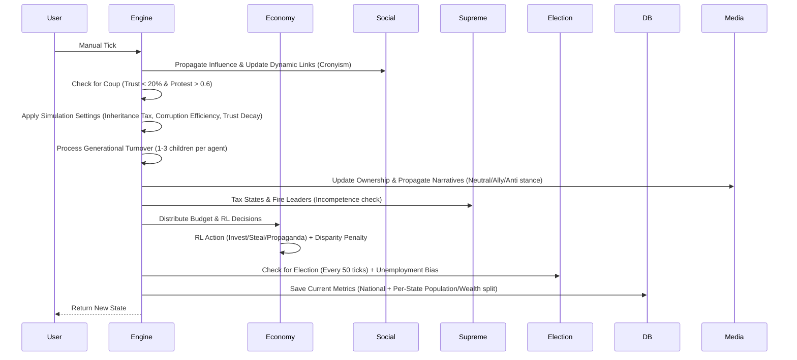

# Architecture & Design

This document outlines the technical architecture and data flow of the Sworm System.

## System Architecture

```mermaid
graph TD
    subgraph Frontend (React + PixiJS)
        UI[App.tsx]
        Map[NationMap.tsx]
        Dash[SimulationDashboard.tsx]
        Chart[HistoryCharts.tsx]
    end

    subgraph Backend (FastAPI)
        Engine[SimulationEngine]
        BrainStack[DecisionPolicy / Strategy]
        Fuzzy[FuzzyMoralityService]
        Economy[EconomyService]
        Social[InfluenceService]
        Media[MediaService]
        Supreme[SupremeLeaderService]
        Election[ElectionService]
    end


    subgraph Persistence
        DB[(SQLite / sworm_history.db)]
    end

    UI -->|API Calls| Engine
    Engine --> BrainStack
    BrainStack --> Fuzzy
    Engine --> Economy
    Engine --> Social
    Engine --> Media
    Engine --> Supreme
    Engine --> Election
    Engine -->|Persist Metrics| DB
    UI -->|Fetch History| DB
    Map -->|Render Agents| UI

```

## Simulation Loop Flow

```mermaid
sequenceDiagram
    participant User
    participant Engine
    participant Economy
    participant Social
    participant Supreme
    participant Election
    participant DB

    User->>Engine: Manual Tick
    Engine->>Social: Propagate Influence & Update Dynamic Links (Cronyism)
    Engine->>Engine: Check for Coup (Trust < 20% & Protest > 0.6)
    Engine->>Engine: Apply Simulation Settings (Inheritance Tax, Corruption Efficiency, Trust Decay)
    Engine->>Engine: Process Generational Turnover (1-3 children per agent)
    Engine->>Media: Update Ownership & Propagate Narratives (Neutral/Ally/Anti stance)
    Engine->>Supreme: Tax States & Fire Leaders (Incompetence check)
    Engine->>Economy: Distribute Budget & RL Decisions
    Economy->>Economy: RL Action (Invest/Steal/Propaganda) + Disparity Penalty
    Engine->>Election: Check for Election (Every 50 ticks) + Unemployment Bias
    Engine->>DB: Save Current Metrics (National + Per-State Population/Wealth split)
    Engine-->>User: Return New State


```

## Data Models
- **Citizen:** `wealth`, `happiness`, `trust_score`, `education`, `ideology`, `social_links`, `age`, `lifespan`.
- **State Leader:** `wealth`, `greed`, `budget_allocated`, `last_action`, `performance_score`, `state_id`, `social_links`.
- **Supreme Leader:** `total_budget`, `tenure`, `logic_manager`.
- **Media:** `ownership`, `bias`, `disinformation_rate`, `stance` (Neutral/Ally/Anti).
- **State:** `population`, `unemployment_rate`, `leader_id`, `budget`.
